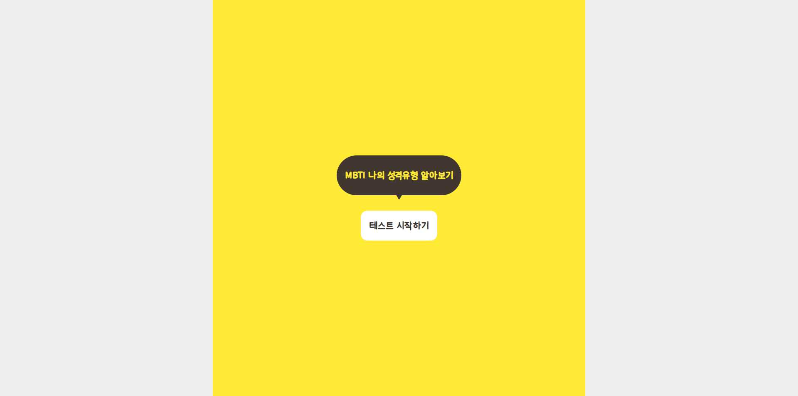
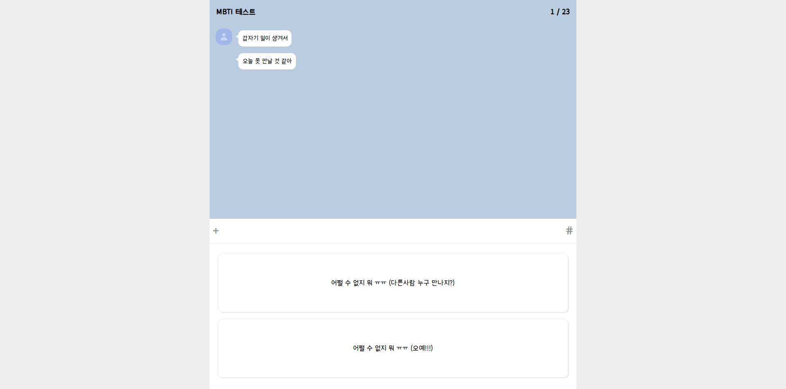
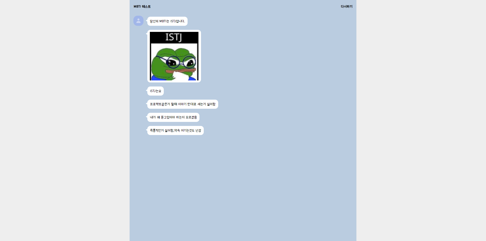

# MBTI TEST
사용자의 성격 유형을 쉽게 파악할 수 있게 도와주는, MBTI 테스트 기능이 구현된 웹사이트입니다.

🔗 LINK : https://mbti-jet.vercel.app/

💻 PERIOD : 2023.11.01 ~ 11.02

🔨 STACK

 

- 사용자의 답변에 따라 MBTI 유형을 산출하는 기능을 구현하였습니다.

- 사용자가 테스트를 시작하면, 질문 목록에서 질문을 하나씩 가져와 보여주며, 사용자의 답변에 따라 MBTI 유형을 산출합니다.

- 각 질문은 두 개의 답변 선택지를 가지고 있고, 각 답변은 MBTI 유형의 한 요소(I, E, S, N, F, T, P, J 중 하나)에 연결되어 있습니다. 사용자가 답변을 선택할 때마다 해당 MBTI 요소의 카운트가 1씩 증가합니다. 

- 모든 질문에 답하면, 가장 높은 카운트를 가진 MBTI 요소들을 조합하여 최종 MBTI 유형을 산출하고, 해당 유형의 특성을 보여줍니다.

